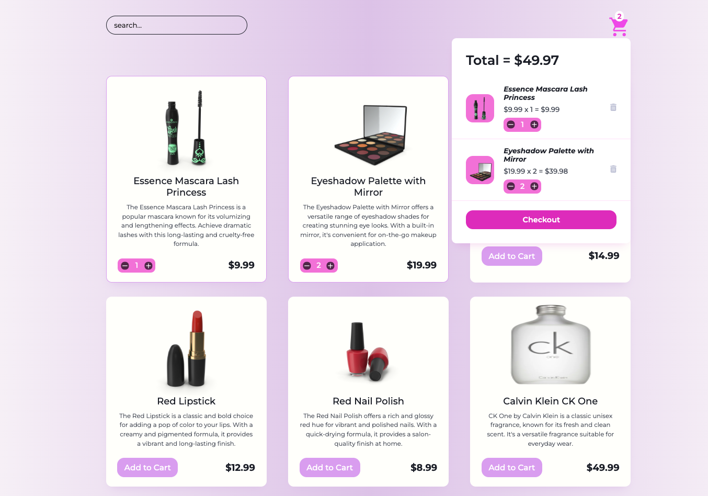

# E-Commerce API Products

Welcome to the **E-Commerce API Products** project! This is a simple and responsive e-commerce application built with modern web technologies. It demonstrates basic e-commerce functionalities such as adding items to a cart, updating quantities, and removing items from the cart. The project is built using **ReactJS**, **Vite**, and the **dummyJSON API** for fetching product data.

## Live Demo

Check out the live site: [victorkevz.github.io/e-commerce-api-products](https://victorkevz.github.io/e-commerce-api-products)

## Repository

Explore the repository on GitHub: [VictorKevz/e-commerce-api-products](https://github.com/VictorKevz/e-commerce-api-products.git)

## Features

### Implemented Features

- **Product Listing**: Fetches and displays a list of products using the dummyJSON API.
- **Add to Cart**: Allows users to add products to their cart. If a product is already in the cart, the quantity is incremented.
- **Increment/Decrement Quantity**: Users can adjust the quantity of items directly from the cart or from the product list.
- **Remove from Cart**: Allows users to remove items from their cart when the quantity reaches zero or through a dedicated delete button.
- **Cart Management**: Display the total number of items and total cost dynamically in the cart.
- **Responsive Design**: Ensures the app is usable on both desktop and mobile devices.
- **Basic State Management**: Utilizes React's `useState` hook for managing the application's state, including product data and cart contents.

### Future Enhancements

- **Image Slider for Each Product**: Implement an image slider to showcase multiple images for each product.
- **LightBox Feature**: Add a LightBox feature for a full-screen view of product images.
- **Sort by Price (Low to High)**: Enable sorting functionality to allow users to sort products by price in ascending order.
- **Checkout Component**: Develop a checkout component with form validation to handle user information and payment details.
- **Animations with Framer-Motion**: Integrate Framer-Motion to add animations for smoother and more interactive user experience.
- **Enhanced Filtering**: Add more filtering options such as categories, brands, and ratings.

## Built With

- **ReactJS**: A JavaScript library for building user interfaces.
- **Vite**: A fast build tool and development server for modern web projects.
- **dummyJSON API**: A simple API for fetching dummy e-commerce product data.
- **HTML** & **CSS**: Markup and styling.
- **JavaScript**: Core programming language used throughout the project.

## Getting Started

To get a local copy up and running, follow these simple steps:

### Prerequisites

Make sure you have the following installed on your local machine:

- **Node.js**: [Download and Install Node.js](https://nodejs.org/)
- **Git**: [Download and Install Git](https://git-scm.com/)

### Installation

1. **Clone the repository**:

```bash
git clone https://github.com/VictorKevz/e-commerce-api-products.git
```

2. **Navigate to the project directory**:

```bash
cd e-commerce-api-products
```

3. **Install dependencies**:

```bash
npm install
```

4. **Start the development server**:

```bash
npm run dev
```

5. **Open your browser** and navigate to:

```
http://localhost:3000
```

### Deployment

The project is currently deployed on GitHub Pages. To deploy any updates:

1. **Build the project**:

```bash
npm run build
```

2. **Deploy to GitHub Pages**:

```bash
npm run deploy
```

Make sure the `homepage` field in your `package.json` is set correctly to `"https://yourusername.github.io/your-repo-name/"`.

## Contributing

Contributions are what make the open-source community such an amazing place to learn, inspire, and create. Any contributions you make are **greatly appreciated**!

1. **Fork the Project**
2. **Create your Feature Branch** (`git checkout -b feature/AmazingFeature`)
3. **Commit your Changes** (`git commit -m 'Add some AmazingFeature'`)
4. **Push to the Branch** (`git push origin feature/AmazingFeature`)
5. **Open a Pull Request**

## License

Distributed under the MIT License. See `LICENSE.txt` for more information.

## Contact

Victor Kevz - [GitHub Profile](https://github.com/VictorKevz)

Feel free to check out my other projects and connect!
